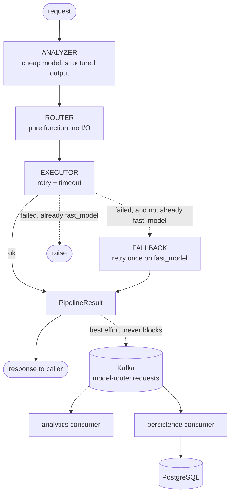

# Intelligent LLM Model Router & Evaluation Platform

Route each request to the model that suits it, instead of sending everything to
the most expensive model available.

## Current pipeline

```
CLI request          HTTP POST /route
    |                     |
    +----------+----------+
               |
               v
ANALYZER  (cheap model, structured output -> TaskProfile, retries transient errors)
    |
    v
ROUTER    (pure function: TaskProfile + ModelCatalog -> RoutingDecision;
           low confidence overrides every other rule -- see below)
    |
    v
EXECUTOR  (calls the selected model, retries transient errors, captures usage)
    |
    v
[failed after retries?] -- yes --> retry once on fast_model, mark fallback_used
    |
    v
PipelineResult -+-> printed, or returned as JSON   (synchronous: the caller waits)
                |
                +-> Kafka topic model-router.requests
                       (asynchronous: best-effort, never blocks the caller)
```

Two transports, one pipeline: `app/main.py` (CLI) and `app/api.py` (HTTP) both
call the same `run_pipeline()`. Neither owns the analyze/route/execute logic.

## Setup

1. Copy `.env.example` to `.env` and set `GEMINI_API_KEY`.
2. Install dependencies:
   `venv\Scripts\python.exe -m pip install -r requirements-dev.txt`
3. Start Kafka and Postgres (needs Docker Desktop running):
   `docker compose up -d`

Keep `.env` private. Every `.env*` file except `.env.example` is ignored by Git.

Step 3 is optional for running the router itself: if Kafka is unreachable,
requests still succeed and only event publishing is skipped (with a logged
warning). Nothing uses Postgres until Phase 6.

## Run

```
venv\Scripts\python.exe -m app.main "Write a Python function that sorts a list."
```

Reads from a pipe when no argument is given.

Or run it as an HTTP service:

```
venv\Scripts\python.exe -m uvicorn app.api:app --reload
```

Then, in another terminal:

```
curl http://127.0.0.1:8000/health
curl -X POST http://127.0.0.1:8000/route -H "Content-Type: application/json" -d "{\"text\": \"Write a Python function that sorts a list.\"}"
```

Or open http://127.0.0.1:8000/docs for an interactive UI generated
automatically from the same type hints -- nobody wrote that page by hand.

To watch events arrive, run the analytics consumer in a second terminal
and then make requests in the first:

```
venv\Scripts\python.exe -m app.consumer
```

It prints a line per event and a per-model summary on Ctrl+C. Stopping it
does not affect the router; restarting it resumes from its last committed
offset rather than replaying everything.

To persist those events to PostgreSQL, run the second consumer:

```
venv\Scripts\python.exe -m app.persist
```

Both consumers read the same topic in different groups, hold separate
offsets, and neither blocks the other.

With the API running, the dashboard is at
http://127.0.0.1:8000/dashboard, and the JSON behind it at `/stats`.

## Test

```
venv\Scripts\python.exe -m pytest
```

No test makes a network call. The Gemini client is injected into every function
that needs it, so tests pass fake clients instead (see `tests/fakes.py`).

Lint:

```
venv\Scripts\python.exe -m flake8 app tests
```

Line length is set to 88 in `setup.cfg`. Without a declared value, editors
fall back to pycodestyle's 79 and flag most of this codebase as a style
violation, which buries real findings under noise.

## Modules

| Module | Responsibility |
| --- | --- |
| `app/schemas.py` | Pydantic contracts shared by every stage |
| `app/config.py` | `.env` -> `Settings` (API key, analyzer model, catalog) |
| `app/analyzer.py` | Request -> validated `TaskProfile` |
| `app/router.py` | `TaskProfile` -> `RoutingDecision` (pure, no I/O) |
| `app/executor.py` | Runs the selected model, captures token usage |
| `app/retry.py` | Exponential-backoff retry for transient provider errors |
| `app/pipeline.py` | Orchestrates analyze -> route -> execute, with fallback |
| `app/client.py` | Builds the one Gemini client both transports share |
| `app/pricing.py` | Per-model prices, and the cost of one model call |
| `app/usage.py` | Reads token counts off a model response |
| `app/evaluation.py` | Runs the dataset through router vs. baseline |
| `app/judge.py` | Pairwise quality judging, with position-bias control |
| `app/events.py` | Publishes one Kafka event per completed request |
| `app/consumer.py` | Reads those events and aggregates per-model stats |
| `app/storage.py` | Upserts completed requests into PostgreSQL |
| `app/schema.sql` | The `requests` fact table and its indexes |
| `app/persist.py` | Second consumer group: writes events to PostgreSQL |
| `app/stats.py` | Aggregate queries behind the dashboard |
| `app/dashboard.html` | The dashboard page, served by the API |
| `app/console.py` | Console helpers shared by both CLI entry points |
| `app/main.py` | CLI adapter over the pipeline |
| `app/api.py` | HTTP adapter over the pipeline (FastAPI + uvicorn) |

## Design notes

**Why structured output plus Pydantic?** The analyzer asks Gemini for JSON
matching `TaskProfile`. Pydantic then validates it, so a hallucinated task type
raises an error at the boundary instead of silently reaching the router.

**Why a separate analyzer model?** The classifier runs on every single request.
Paying for an expensive model just to decide which model to use would defeat the
purpose of routing, so `GEMINI_ANALYZER_MODEL` is configured independently of the
catalog.

**Why is the router a pure function?** Routing policy is the part most likely to
change. Keeping it free of I/O means its rules are tested exhaustively without
network calls or API keys.

**Why is orchestration in `pipeline.py` rather than `main.py`?** `main.py` is
one transport, `app/api.py` is another. Both call the same `run_pipeline()`,
so neither owns the logic -- adding HTTP required zero changes to analyze,
route, or execute.

**Why pinned model versions instead of `-latest` aliases?** A floating alias
would change the underlying model without warning, which would invalidate any
historical evaluation metrics collected against it.

**What retries, and what falls back?** `app/retry.py` retries one call on
5xx errors, 429 rate limits, and network timeouts. It backs off
exponentially *unless* the server said how long to wait: a Gemini 429
carries a `RetryInfo` hint, and honouring it beats guessing 1s against a
per-minute quota. Hints beyond 75s are capped, since a quota that will
not clear inside the request's lifetime is better failed than waited on.
The retryable set is 5xx, 429, and network errors --
failures worth waiting out. A 400/404 is a defect in the request itself, so it
is not retried; retrying it three times would only waste the timeout budget on
an outcome that was never in doubt. If the *routed* model still fails after its
own retries, `pipeline.py` retries the whole request once on `fast_model` and
marks the result `fallback_used` -- because in this project's own measurements
(below), a model failing mid-request is routine, not exceptional. A request
already routed to `fast_model` has nowhere safer to fall back to, so its
failure propagates. The analyzer has no such fallback yet: a persistent
classification failure still fails the whole request.

**Why does low confidence override every other routing rule, not just add
one more rule?** `TaskProfile.confidence` describes the classification as a
whole -- there's one score, not one per field. A profile with confidence
0.5 doesn't mean "context_size is uncertain but task_type is fine"; every
field came from the same uncertain classification. So `router.py` checks
confidence *first*: below `CONFIDENCE_THRESHOLD` (0.6, an unmeasured
starting guess -- Phase 5 should tune it from real accuracy data), routing
falls back to `reasoning_model` regardless of what `context_size` or
`task_type` say, because trusting those fields to pick a specialized model
would be trusting a coin flip. Confirmed live: a deliberately vague prompt
("so like, idk, maybe do the thing with the stuff from before") scored
confidence 0.50, correctly routed to the reasoning model over the normal
rules -- and that model then failed on its own, correctly triggering the
*separate* fallback mechanism above. Both Phase 3 safety nets, one request.

## FastAPI concepts used here

**FastAPI vs. uvicorn.** FastAPI defines *what* exists: which URLs are
routes, what Python function each one calls, what shape the request/response
are. It does not open a network socket. uvicorn is the ASGI server -- the
actual program that binds a port, speaks HTTP, and calls into FastAPI per
request. Every "run a FastAPI app" command is really "run uvicorn, pointed
at a FastAPI app object."

**Path operations.** `@app.get("/health")` / `@app.post("/route")` register a
function to run for that method + URL. FastAPI reads the function's type
hints to know what to validate on the way in and how to serialize on the way
out -- the same idea `TaskProfile` already uses for structured LLM output,
just applied to HTTP instead.

**Request/response models are Pydantic.** `RouteRequestBody` in `app/api.py`
is a normal `BaseModel`. FastAPI validates the incoming JSON against it
*before* `route_request()` runs -- a request that fails validation (missing
`text`, or blank after our `field_validator`) never reaches our code; FastAPI
returns `422 Unprocessable Entity` itself. `response_model=PipelineResult`
does the same thing in reverse: return a `PipelineResult` and FastAPI
serializes it to JSON, using the schema already defined in `app/schemas.py`.

**Dependency injection (`Depends`).** `get_settings`/`get_client` in
`app/api.py` are dependencies: FastAPI calls them and passes the result into
the handler. The payoff is in `tests/test_api.py` --
`app.dependency_overrides[get_client] = lambda: scripted_fake` swaps in a
fake for the whole test, with no monkeypatching and no real network access,
the same way `client=` injection already let `analyzer.py`/`executor.py` be
tested without a real Gemini client.

**`lifespan`.** Settings and the Gemini client are built once, when the
server starts (`app/api.py`'s `lifespan` function), not on every request.
A CLI run is one process per request, so `main.py` rebuilding them each time
is fine; a server handles many requests over one process's lifetime, so
doing this per-request would mean reconnecting on every call and only
discovering a broken `.env` on the *first* request instead of before the
server accepts any traffic.

**Sync `def`, not `async def`.** `route_request` is declared as a plain
`def`. `run_pipeline` makes blocking network calls (google-genai is a
synchronous SDK). FastAPI automatically runs sync path operations in a
worker thread pool, so one slow request doesn't stall every other request
being served concurrently. Writing `async def` around a blocking call would
run it directly on the event loop and serialize every request behind
whichever one is mid-call -- the opposite of what async is for.

**HTTP status codes carry meaning.** `422` = your request body failed
validation (client's fault). `502` = we tried to call an upstream service
(Gemini) and it failed even after retry and fallback (not our bug, not the
caller's fault either). An uncaught bug becomes FastAPI's own `500`. Mapping
these deliberately, rather than returning `200` with an error message in the
body, is what lets a caller branch on `response.status_code` instead of
parsing text.

## Kafka concepts used here

**Why Kafka at all, and why not in the request path?** The router produces
data worth analyzing -- which model was chosen, what it cost, how long it
took, whether fallback fired. Analytics, evaluation, and logging all want
that same data, at their own pace, without any of them slowing down the
person waiting for an answer. That is the actual problem Kafka solves here:
one producer, many independent consumers, none of them in the caller's way.
If it were in the synchronous path, a slow or down Kafka would make the
whole router slow or down -- strictly worse than not having it.

**Broker, topic, partition.** The broker is the server (our `kafka`
container). A topic (`model-router.requests`) is a named stream. Each topic
is split into partitions, and each partition is an independent append-only
log. Kafka guarantees ordering *within* a partition, not across a topic --
that is the tradeoff that buys parallelism, since partitions can be
consumed independently.

**Keys decide partitions.** `KafkaEventPublisher` keys each event by
`request_id`. Kafka hashes the key to pick a partition, so all events
sharing a key land in the same partition and keep their relative order.
With one event per request today this mainly spreads load, but it is what
makes ordering work if a request ever emits several events.

**Consumer groups and offsets.** An offset is how far a consumer group has
read into a partition. Kafka stores it server-side, per group -- not in the
consumer process -- which is why a restarted consumer resumes where it left
off, and why two different groups can read the same topic completely
independently (analytics and evaluation will each be their own group).
`kafka-consumer-groups.sh --describe --group <name>` shows
`CURRENT-OFFSET` / `LOG-END-OFFSET` / `LAG` per partition; lag is the
single most useful "is my consumer keeping up" number.

**Retention.** Kafka keeps messages for a configured time whether or not
anyone consumed them (default `log.retention.hours=168`, one week). This is
the real difference from a traditional queue, where a message disappears
once acknowledged -- and it is what lets a new consumer group be added
later and still read last week's events.

**produce vs. poll vs. flush** -- the easiest thing to get wrong:
`produce()` queues locally and returns immediately (this is what makes
publishing async); `poll(0)` services already-completed delivery callbacks
without blocking; `flush()` blocks until everything queued is actually
sent. `flush()` belongs only where a process is about to exit and would
otherwise drop queued messages -- `main.py` after printing the answer, and
`api.py`'s lifespan shutdown. Calling it per request would convert this
whole async design back into a synchronous one.

**Delivery semantics -- and why the two sides differ.** They are chosen
independently, and here they are deliberately opposite:

*Producing is at-most-once.* `publish_safely()` swallows failures, so an
event can be lost (Kafka down, or the process dies with messages still
queued) and is never retried. Telemetry loss is cheaper than failing a
user's request, and cheaper than an outbox table. At-least-once producing
would mean persisting the event locally first and retrying delivery -- a
real option once Phase 6 provides a database to put an outbox in.

*Consuming is at-least-once.* `app/consumer.py` commits the offset
**after** processing, so a crash in between redelivers the event rather
than dropping it. Committing before processing would be at-most-once and
lose it. The cost is that processing must tolerate duplicates: the
in-memory counters would double-count, which is fine for a restartable
local aggregate but is exactly why Phase 6's Postgres writes must be
idempotent -- upsert on `request_id`, never a blind insert.

**Poison messages.** A malformed event is logged and its offset committed
past, rather than retried forever. Without that, one bad message blocks
its partition permanently, because the offset would never advance.

**Schema evolution: old events outlive the schema that wrote them.** A
topic holds a week of history, so events written before a field existed
are still there to be read. When `estimated_cost_usd` was added, older
events had no such key -- they still parse, because the field has a
default of `None`, and the consumer reports them as unpriced rather than
free. Had the field been required instead, every historical event would
have started failing validation and been skipped as a poison message.
New fields on an event schema want a default, for the same reason a
database migration wants one.

**Client errors are callbacks, not exceptions.** A connection failure
never raises from `produce()` or `poll()` -- the client retries in the
background and reports through the `error_cb` both clients configure in
`base_client_config()`. Without that callback, an unreachable broker
looks exactly like an idle one.

**Verified end to end**, not just unit-tested: a CLI run and an HTTP
`POST /route` each produced an event on `model-router.requests` whose
`request_id` matched the response, read back with
`kafka-console-consumer.sh`. With Kafka deliberately stopped, both
transports still returned complete, correct answers -- only a warning
line differed.

## Cost

Prices live in `app/pricing.py`, not `.env`: which models to *use* is
deployment config, what they *cost* is reference data about the models
themselves, and a price change deserves a diff and a review.

Paid-tier rates per 1M tokens, from
[Google's pricing page](https://ai.google.dev/gemini-api/docs/pricing)
(checked 2026-09-05):

| Model | Input | Output |
| --- | --- | --- |
| `gemini-3.5-flash-lite` | $0.30 | $2.50 |
| `gemini-3.5-flash` | $1.50 | $9.00 |
| `gemini-3.6-flash` | $0.75 | $3.75 |
| `gemini-3.7-flash` | $0.75 | $3.75 |

**Thinking tokens bill as output.** Google states this explicitly, and it
is not a rounding detail. A real measured call: 11 in, 613 out, **1124
thinking** -- billable output is 1737, not 613, so the call costs
$0.015650 instead of $0.005533. Ignoring thinking tokens would understate
that request by 65%.

**The reasoning tier is not the priciest tier.** `gemini-3.6-flash`
($0.75/$3.75) is cheaper per token than `gemini-3.5-flash`
($1.50/$9.00), even though the router treats it as the heavier tier.
Capability order and price order are different things -- so "routing hard
requests to the reasoning model costs more" is an assumption to measure,
not to accept. A test in `tests/test_pricing.py` pins this down so the
assumption cannot quietly creep back in.

**Unpriced is not free.** `estimate_cost_usd` returns `None`, never
`0.0`, for a model missing from `PRICING`. Zero would silently deflate
every total built on top of it, and an evaluation that undercounts cost
is worse than one that admits a gap. The consumer counts those requests
separately and prints `n/a` rather than `0.000000`.

**These are modelled costs, not a bill.** This project's key is
free-tier, so nothing here was actually charged. That is the right basis
for comparing routing strategies against each other, but it must not be
reported as money genuinely spent.

### Routing overhead, and where it breaks even

The classifier runs on every request, so **what routing costs is part of
what routing costs you**. `PipelineResult` therefore reports both halves
separately, and `total_cost_usd` is the only number fair to compare
against a baseline that never classifies anything.

The overhead is not small. Measured on a trivial factual request:

| | Tokens | Cost |
| --- | --- | --- |
| Classification | 99 in / 61 out | `$0.000182` |
| Answering | 8 in / 7 out | `$0.000020` |
| **Total** | | **`$0.000202`** |

**90% of that request's cost was deciding who should answer it.** The
classifier's prompt and its JSON reply together dwarf a seven-token
answer.

Read alone, that number indicts the whole idea. It shouldn't, and the
arithmetic says why: the overhead is a *fixed floor*, and the saving
grows with output length. Against always using `gemini-3.5-flash`, with
a 100-token prompt, routing to `flash-lite` breaks even at **9.5 output
tokens** — and wins by ~$0.0019 on a 300-token answer, ~$0.0064 on a
1000-token one.

So the honest claim is narrower than "routing saves money": routing
saves money on any request whose answer is longer than about ten tokens,
**and** which the router actually downgrades. On a request it routes to
the same model the baseline would have used, routing is pure overhead
with no saving at all. How often each case occurs is an empirical
question about real traffic — which is what the evaluation harness
exists to answer.

## Evaluation

```
python -m app.evaluation --dry-run     # what it would run, and how many calls
python -m app.evaluation --limit 4     # first 4 cases
python -m app.evaluation               # the whole dataset
```

`evaluation/dataset-v1.json` is a fixed, versioned set of requests, each
labelled with the task type the analyzer *should* produce — which is what
makes routing accuracy measurable rather than assumed. Editing a case
changes what the numbers mean, so a change belongs in a `v2` file, for
the same reason model versions are pinned.

Three things make the comparison fair, and each would invalidate it if
dropped:

1. **Both strategies use the same executor**, so both get identical
   retries and timeouts. Comparing a careful router against a naive
   baseline would prove nothing.
2. **The router's cost includes the classifier.** It pays for a call the
   baseline never makes.
3. **The baseline is the honest null hypothesis** — always use the
   strongest model — i.e. what you would do having never built a router.

Evaluation runs pass no Kafka publisher, so synthetic events never
pollute the topic that real traffic and the analytics consumer share.

### What the harness found, immediately

Its first real run said routing was **71.9% more expensive** than the
baseline. The per-case breakdown showed why:

| Case | Routed to | Router | Baseline | Delta |
| --- | --- | --- | --- | --- |
| factual-01 | `flash-lite` | $0.000202 | $0.000310 | +0.000108 |
| factual-02 | `flash-lite` | $0.000267 | $0.000537 | +0.000270 |
| math-01 | `flash-lite` | $0.000748 | $0.002879 | +0.002131 |
| **coding-01** | **`3.5-flash`** | **$0.013528** | $0.004852 | **−0.008676** |

Three cases saved $0.0025 between them. One case lost $0.0087 — wiping
out those savings three and a half times over.

The cause was the pricing quirk documented above: `gemini-3.5-flash`
($1.50/$9.00) is the **dearest model in the catalog**, dearer than the
"reasoning" tier it supposedly sits below. Routing a coding request "up"
to it was a cost regression, not an optimization. The routing policy was
built on the assumption that higher tier means higher capability *and*
higher price; only the first half was true.

Pointing the code tier at `gemini-3.6-flash` — cheaper *and* newer —
flipped the result to **32.1% cheaper**, with `coding-01` landing at
+$0.000021: essentially zero, because it now routes to the same model
the baseline uses. That is the predicted behaviour, confirmed: routing
saves nothing on a request it sends to the model the baseline would have
picked anyway.

**The honest caveat.** This is a cost result on four cases, and cost is
not quality. A router that always chose the worst model would score
perfectly on every number above. Closing that gap is what the judge
below is for.

### Judging quality

```
python -m app.evaluation --limit 3 --judge --delay 20
```

`app/judge.py` asks a model which of two answers better serves the
request. Three design choices carry it:

**Pairwise, not a 1–5 score.** The question is comparative, and LLM
judges are markedly more reliable choosing between two answers than
assigning an absolute score, which drifts between runs and skews
lenient.

**Every pair is judged twice, orders swapped.** Judges favour whichever
answer they see first, independent of content. Requiring both passes to
agree turns that bias from a silent thumb on the scale into a visible
disagreement, reported as `inconsistent` rather than resolved by a coin
flip. The reported `order-consistency` is how often the judge survived
its own swap — if that number is low, the verdicts are noise and the
report says so.

**The judge is blind** to which model wrote which answer.

Two biases this does *not* solve, and which belong beside every result:
**self-preference** — the judge is the same model family as the answers
it grades, and escaping that needs a different provider than this key can
reach — and **verbosity**, partly mitigated by instructing the judge to
ignore length, and made detectable by reporting the mean length gap.

First judged run, two factual cases, baseline `gemini-3.5-flash`, judge
`gemini-3.5-flash-lite`:

| | Result |
| --- | --- |
| Cost | routing **78.7% cheaper** ($0.000469 vs $0.002205) |
| Quality | **2 ties, 0 wins either way** |
| Order-consistency | **100%** |
| Length gap | −2 chars |
| Judging cost | **$0.000528** |

So on these two cases routing was much cheaper and the judge — steady
across both orderings, with no length advantage to explain it away —
found nothing to choose between the answers. That is the first result
here that supports the project's claim with a quality control attached.

Read it narrowly. Two trivial factual questions ("What is the capital of
Denmark?") are the easiest possible case for a cheap model, and a tie is
the expected outcome when there is one short correct answer. The
interesting cases — coding, reasoning — went untested because the daily
quota ran out, see below.

**Judging cost more than the thing it judged**: $0.000528 against a
$0.000469 router run. Evaluation is not free, and a judge invoked per
request in production would cost more than the routing it validates.
That is why judging is an offline `--judge` flag over a fixed dataset,
not something the pipeline does.

### Free-tier quotas constrain all of this

Two separate limits, both discovered by hitting them:

| Quota | Limit |
| --- | --- |
| `GenerateRequestsPerMinutePerProjectPerModel` | **5 / minute** |
| `GenerateRequestsPerDayPerProjectPerModel` | **20 / day** |

A judged case spends about five calls, three of them on the baseline
model — so roughly **six judged cases per model per day**. Three
evaluation runs exhausted `gemini-3.6-flash` for a whole day.

This shaped two pieces of the code. `--delay` paces a run rather than
colliding with the per-minute limit, and `app/retry.py` now reads the
server's own `RetryInfo` hint (`"retryDelay": "56s"`) instead of backing
off 1s and 2s into a per-minute quota that cannot possibly have cleared.
Exponential backoff is the right default only when the server has not
told you exactly how long to wait.

## PostgreSQL

Persistence sits behind Kafka, not in the request path, for the same
reason publishing does: the caller must never wait on a database. If
Postgres is down, requests keep being answered and the events wait in the
topic until `app/persist.py` comes back and drains them.

**One wide table, not a normalized model.** `requests` is a fact table.
The profile, the routing decision, and the response are all facts about
one finished request; none is ever updated alone or shared with another
row. Splitting them across four tables would buy nothing and cost a
four-way join on every analytics query.

**Every write is an upsert.** `app/consumer.py` commits offsets *after*
processing, which is at-least-once: a crash between the write and the
commit redelivers the event on restart. A plain `INSERT` would then fail
on a duplicate key. Keying on `request_id` with `ON CONFLICT DO UPDATE`
means seeing an event twice produces the same single row — verified by
writing one event three times and getting one row back.

`DO UPDATE` rather than `DO NOTHING` is deliberate: replay is a real
tool. This project has already changed how cost is calculated once, and
rows written before that change are wrong. Resetting a consumer group to
the start of the topic repairs them; `DO NOTHING` would skip them
forever.

**Money is `NUMERIC(12,8)`, not floating point.** These are sub-cent
values summed across many rows, which is precisely where binary floats
accumulate error. Cost columns are nullable, so "could not be priced"
reaches the database as `NULL` rather than a lying `0.00` — the same rule
`app/pricing.py` follows, carried all the way through the event into the
schema. Rows written before cost tracking existed show exactly that.

**Schema is applied with `CREATE TABLE IF NOT EXISTS` on startup.** That
is enough while the schema only grows. The first time a column must
change type or be dropped without losing rows, this needs Alembic —
`IF NOT EXISTS` silently does nothing to a table that already exists
with the wrong shape.

The query the table exists to answer:

```sql
SELECT response_model,
       count(*)                AS requests,
       round(avg(latency_ms))  AS avg_ms,
       sum(answering_cost_usd) AS answering,
       sum(analyzer_cost_usd)  AS routing,
       count(*) FILTER (WHERE answering_cost_usd IS NULL) AS unpriced
FROM requests
GROUP BY response_model;
```

`sum()` ignores NULLs and the `FILTER` clause counts them, so an unpriced
request cannot quietly deflate a total — the same honesty the in-memory
consumer has, expressed in SQL.

## Why LangChain is not used

Phase 7 was "adopt LangChain where it genuinely reduces complexity". It
was evaluated against this codebase and rejected, on measurements rather
than taste. Reproduce with:

```
pip install langchain langchain-google-genai
```

**What it would replace.** Only the structured-output setup. This:

```python
config=types.GenerateContentConfig(
    response_mime_type="application/json",
    response_schema=TaskProfile,
)
```

becomes `.with_structured_output(TaskProfile, include_raw=True)`. That is
about three lines saved, at two call sites — the analyzer and the judge.

**What it would cost.** 18 additional packages, and an adapter for a
token-accounting difference that is easy to miss. Same prompt, same
model, both libraries:

| | prompt | visible output | thinking | total |
| --- | --- | --- | --- | --- |
| `google-genai` | 13 | 85 | 744 *(separate)* | 842 |
| LangChain | 13 | 656 *(includes reasoning)* | 579 | 669 |

Raw google-genai reports thinking tokens **separately** from visible
output. LangChain **folds them into** `output_tokens`. `estimate_cost_usd`
computes billable output as `output + thinking`, which is correct for the
raw SDK and would double-count against LangChain — 1235 billable tokens
where the true figure is 656, an **88% overstatement**, in the one
calculation this project's central claim rests on. Adapting for that
takes roughly twelve lines, so the swap is a net *increase* in code.

**What it would not buy.** LangChain's real value is provider
portability, and this project reaches one provider: the Anthropic path
was explored in Phase 2 and closed off by plan limits. Its `.with_retry()`
is generic exponential backoff, which would be a regression — `app/retry.py`
honours Gemini's `RetryInfo` hint, a fix found only by hitting a real 429.
Its `.with_fallbacks()` is close to `pipeline.py`'s twelve lines, but ours
knows not to fall back when already on the fast model and records
`original_model`.

**When this should be revisited.** The moment a second provider is
reachable, or the workload needs streaming or tool-calling loops. At that
point the portability LangChain sells starts being worth its weight.
Until then, adding it would be exactly the resume-driven dependency this
project set out to avoid.

## Why LangGraph is not used

Phase 8 asked for LangGraph "because the workflow is stateful and
conditional, not because we want it on the stack". So the workflow was
built as a `StateGraph` and compared against the existing function.
Reproduce with `pip install langgraph`.

**The spike reached full behavioural parity** on all three paths — normal
routing, fallback after a failure, and the rule that a request already on
`fast_model` re-raises instead of looping. Both implementations returned
identical routing, identical fallback flags, and the same exception type.

**Then it was measured:**

| | Current | LangGraph |
| --- | --- | --- |
| Orchestration code | **39 lines** | **93 lines** |
| Packages | 0 extra | 15 |

Two and a half times the code for the same behaviour, and the extra
lines are not incidental:

- `client` and `settings` were plain function arguments. A graph node
  receives only state, so they had to be stashed *inside* the state
  dictionary — dependencies smuggled into a data structure.
- The "already on fast_model" rule became a `raise` inside the routing
  function that picks the next edge. A function whose job is to return
  an edge name is the wrong place to throw from.

**The honest reason it does not fit.** LangGraph earns its weight on
cycles, checkpoint/resume, human-in-the-loop interrupts, and parallel
fan-out. This request path has none: it is linear, has exactly one
branch, finishes in about three seconds, and runs in one process. A
graph framework is the right tool for a graph, and this is a line.

**The cycle that would justify it is one we measured as uneconomic.**
The roadmap diagrammed `Generate → Evaluate → Bad → Retry`, which is a
genuine loop. But Phase 5 measured judging at `$0.000528` against a
`$0.000469` request — *the judge costs more than the thing it judges*.
Putting it in the request path would roughly double per-request cost to
catch a quality problem that judged 2 ties out of 2. That is why judging
is an offline flag over a fixed dataset, and why the loop that would
earn LangGraph does not exist.

**Revisit when** the request path grows a real cycle — a retry loop
driven by a cheap validity check rather than an LLM judge, or
tool-calling — or when a workflow runs long enough that resuming it
after a crash matters.

**What was kept.** The spike's one genuinely useful output was a diagram,
which costs nothing to keep once the dependency is gone:



## Dashboard

`GET /dashboard` renders request volume, model distribution, latency
(mean and p95), cost split into routing and answering, token usage,
average confidence, fallback rate, and the ten most recent requests.
`GET /stats` returns the same numbers as JSON.

**No new dependency, no build step, no extra container.** The API and the
database already existed, so the dashboard is one endpoint and one
self-contained HTML file — no framework, and no CDN, so it renders with
the API and nothing else. A charting library or a Grafana container would
have been more machinery than the question deserves.

**It reads history, never the request path.** `/route` does not touch
PostgreSQL; the dashboard queries only what the persistence consumer has
already stored, so a slow aggregate can never slow an answer.

**Each `/stats` call opens its own connection.** A psycopg connection is
not safe to share across threads, and FastAPI runs sync handlers in a
thread pool, so a shared connection would need a pool to be correct. A
dashboard polled every few seconds does not justify that dependency; a
few milliseconds of connecting is the cheaper trade.

**Unpriced requests are shown, not hidden.** SQL's `sum()` skips NULL, so
a table full of unpriced rows would otherwise report a confident `$0.00`.
The totals carry an `unpriced` count, and a model whose requests were all
unpriced shows `n/a` rather than a zero — the same rule as
`app/pricing.py`, now visible in the UI.

Verified end to end: a request through the CLI, published to Kafka,
drained by the persistence consumer, and appearing in `/stats` — 8 rows
across 4 task types, with the p95 column computed by
`percentile_cont` in PostgreSQL.

**What it does not show.** Evaluation results and judged quality live in
`app/evaluation.py`, which prints to the console and persists nothing.
Putting those on the dashboard means first storing them, which is a
schema change rather than a UI one, and is not done.

## Running the whole system in Docker

```
docker compose up -d --build
```

Brings up four containers — Kafka, PostgreSQL, the API, and the
persistence consumer — with the API on
http://127.0.0.1:8000 and the dashboard at `/dashboard`.

**One image, two roles.** `app` and `persistence` are the same image
differing only by `command`. One build, so the two cannot drift apart.

**Addresses differ inside the network, which is what the two Kafka
listeners were for.** From the host, Kafka is `localhost:9092`
(`PLAINTEXT_HOST`). From another container it is `kafka:19092`
(`PLAINTEXT`). The app services override `KAFKA_BOOTSTRAP_SERVERS` and
`POSTGRES_HOST` accordingly; everything else comes from `.env`.

**Secrets stay out of the image.** `.dockerignore` excludes `.env` before
the build context is even uploaded, and configuration arrives through the
environment at run time. Verified by searching the built image: no `.env`
anywhere in it. `tests/` and `venv/` are excluded too, and the image
installs `requirements.txt` only — which is why `requirements-dev.txt`
was split out in Phase 2: pytest and flake8 never reach production.

**Non-root.** The container runs as uid 10001. A process that does not
need to own the filesystem should not.

### The Kafka healthcheck is a TCP connect, deliberately

The obvious check is `kafka-topics.sh --list`. It was tried, and it
**took 68 seconds** on this machine, because each probe starts a JVM — so
it can never pass a sensible timeout and marks a working broker
unhealthy. Two corrections came out of getting this wrong:

- The check is now a bare TCP connect to the listener. Weaker than
  "serving metadata", but it is the claim worth making every 15 seconds.
- It uses `CMD`, not `CMD-SHELL`. `/dev/tcp` is a bash builtin and this
  image's `/bin/sh` is not bash, so `CMD-SHELL` fails with
  "nonexistent directory" whether the broker is up or not.

Verified end to end in containers: `POST /route` answered by the
containerized API, the event consumed by the containerized persistence
consumer, and the row visible through `/stats`.

## Model availability

`client.models.list()` is not a reliable guide to what a key can actually call.
Measured against this project's free-tier key with one identical prompt:

| Model | Latency | Notes |
| --- | --- | --- |
| `gemini-3.5-flash-lite` | ~2s | no thinking tokens |
| `gemini-3.5-flash` | ~6-14s | ~600-1200 thinking tokens |
| `gemini-3.6-flash` | ~19s | ~900 thinking tokens |
| `gemini-3.7-flash` | 504 | `DEADLINE_EXCEEDED`, unusable |
| `gemini-2.5-pro`, `gemini-2.5-flash` | 404 | listed but `NOT_FOUND` |
| `gemini-pro-latest`, `gemini-3.1-pro-preview` | 429 | `RESOURCE_EXHAUSTED` |

Two consequences worth understanding:

1. **No pro-tier model is reachable without billing enabled.** The catalog is
   therefore three flash tiers. They differ in latency and thinking-token usage,
   which is enough to build and demonstrate routing, but Phase 5 will not be able
   to show a large *quality* gap between tiers until a stronger model is
   reachable.
2. **Models fail in normal operation**, not just in theory. `gemini-3.7-flash`
   reliably 504s and every pro-tier model 429s -- confirmed live, not just in
   this table. Retry and fallback (see "What retries, and what falls back?"
   above) exist because of this measurement, not on general principle.

## Roadmap

Phase 1 Basic LLM integration — done
Phase 2 Intelligent routing — done
Phase 3 Reliability — done: retries, timeouts, fallback, the FastAPI
         transport, and confidence-aware routing
Phase 4 Kafka — done: infrastructure, a producer (one event per request),
         and an analytics consumer that aggregates per-model stats
Phase 5 Evaluation — done: cost calculation, a versioned dataset, a
         router-vs-baseline harness, and pairwise quality judging with
         position-bias control
Phase 6 PostgreSQL — done: a requests fact table, idempotent upserts, and
         a second consumer group that persists the event stream
Phase 7 LangChain — evaluated and declined, with measurements; see
         "Why LangChain is not used". Revisit on a second provider.
Phase 8 LangGraph — evaluated and declined, with measurements; see
         "Why LangGraph is not used". Revisit on a real cycle.
Phase 9 Dashboard — done: /stats and /dashboard over the requests table,
         no new dependency. Evaluation results are not persisted, so not shown.
Phase 10 Productionization — done: the app is containerized and the whole
         system comes up with one command. Not deployed to a host; the
         architecture diagram, API docs and benchmarks already existed.
